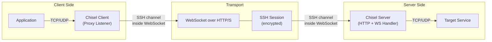
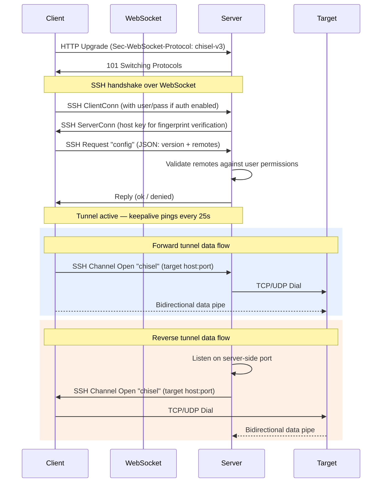
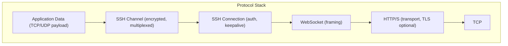

# Architecture

Chisel is a TCP/UDP tunneling tool transported over HTTP and secured via SSH. A single Go binary acts as both client and server. It is a fork of [jpillora/chisel](https://github.com/jpillora/chisel), maintained by OutSystems with custom build/release pipelines.

## High-Level Overview



**Forward tunnel:** Client listens locally, traffic flows through the server to the target.

**Reverse tunnel:** Server listens, traffic flows back through the client to a target behind the client.

## Project Structure

```
chisel/
├── main.go              # CLI entrypoint — parses flags, delegates to client or server
├── client/              # Client package
│   ├── client.go        # Client struct, config, initialization, TLS, SSH setup
│   └── client_connect.go# Connection loop with backoff and reconnection
├── server/              # Server package
│   ├── server.go        # Server struct, config, SSH key management, auth
│   ├── server_handler.go# HTTP/WebSocket handler, SSH handshake, tunnel setup
│   └── server_listen.go # TCP listener with TLS (manual certs or LetsEncrypt)
├── share/               # Shared library packages
│   ├── version.go       # Protocol version ("chisel-v3") and build version
│   ├── compat.go        # Backwards-compatible type aliases
│   ├── ccrypto/         # Key generation, fingerprinting (ECDSA/SHA256)
│   ├── cio/             # Bidirectional pipe, logger, stdio
│   ├── cnet/            # WebSocket-to-net.Conn adapter, HTTP server with graceful shutdown
│   ├── cos/             # OS signals (SIGUSR2 stats, SIGHUP reconnect), context helpers
│   ├── settings/        # Config encoding, remote parsing, user/auth management, env helpers
│   └── tunnel/          # Core tunnel engine — proxy, SSH channel handling, keepalive, UDP
├── test/
│   ├── e2e/             # End-to-end tests (auth, TLS, SOCKS, UDP, proxy)
│   └── bench/           # Benchmarking tool
├── Dockerfile           # Alpine-based container image
├── goreleaser.yml       # GoReleaser config — builds Linux binary, pushes to GHCR
└── Makefile             # Build targets for cross-compilation, lint, test, release
```

## Component Responsibilities

### `main.go` -- CLI

Parses the top-level command (`server` or `client`), then delegates to dedicated flag parsers. Handles environment variable fallbacks for host, port, auth, and key configuration.

### `client/` -- Tunnel Client

- Establishes a WebSocket connection to the server (optionally through an HTTP CONNECT or SOCKS5 proxy).
- Upgrades the WebSocket to an SSH connection and performs host key fingerprint verification.
- Sends its tunnel configuration (list of remotes) to the server for validation.
- Runs a **connection loop** with exponential backoff for automatic reconnection.
- Creates local **Proxy** listeners for forward tunnels. For reverse tunnels, the server side creates the listeners.

### `server/` -- Tunnel Server

- Listens on HTTP(S) with optional TLS (manual key/cert or automatic LetsEncrypt via `autocert`).
- Upgrades incoming WebSocket connections (matching the `chisel-v3` protocol) to SSH server sessions.
- Authenticates users via SSH password auth, checked against an auth file (`users.json`) that hot-reloads on changes via `fsnotify`.
- Validates client-requested remotes against user permissions (regex-based address matching).
- Falls back to a reverse proxy for non-WebSocket HTTP requests, or serves `/health` and `/version` endpoints.

### `share/tunnel/` -- Tunnel Engine

The core data-plane, shared by both client and server:

- **`Tunnel`** -- Binds an SSH connection and manages its lifecycle (keepalive pings, channel handling).
- **`Proxy`** -- Listens on a local address (TCP, UDP, or stdio) and pipes traffic through SSH channels.
- **Outbound handler** -- Receives SSH channel open requests and connects to the target host (TCP dial, UDP dial, or SOCKS5 proxy).
- **UDP multiplexing** -- Encodes/decodes UDP packets with source address metadata over a single SSH channel using `gob` encoding.

### `share/settings/` -- Configuration

- **`Remote`** -- Parses the `local:remote` format (e.g., `3000:google.com:80`, `R:2222:localhost:22`, `socks`, `stdio:host:port`).
- **`Config`** -- JSON-serialized handshake payload exchanged between client and server over SSH.
- **`UserIndex`** -- Loads and watches the auth file, manages user permissions with regex-based address ACLs.
- **`Env`** -- Reads `CHISEL_*` environment variables for tuning (timeouts, buffer sizes, UDP settings).

### `share/ccrypto/` -- Cryptography

Generates ECDSA P256 keys (deterministic from seed or random), converts between PEM and chisel key formats, and computes SHA256 fingerprints for host key verification.

### `share/cnet/` -- Network Adapters

- **`wsConn`** -- Wraps `gorilla/websocket.Conn` as a standard `net.Conn` with buffered reads.
- **`HTTPServer`** -- Extends `net/http.Server` with context-aware graceful shutdown.

## Connection Lifecycle



## Protocol Layers



This layering means chisel traffic looks like regular HTTP/WebSocket traffic to firewalls and proxies, while the SSH layer provides encryption and authentication.

## External Dependencies

| Dependency | Purpose |
|---|---|
| `gorilla/websocket` | WebSocket transport layer |
| `golang.org/x/crypto/ssh` | SSH protocol implementation (encryption, auth, channels) |
| `golang.org/x/crypto/acme/autocert` | Automatic TLS certificates via LetsEncrypt |
| `armon/go-socks5` | Built-in SOCKS5 proxy server |
| `jpillora/backoff` | Exponential backoff for client reconnection |
| `fsnotify/fsnotify` | Hot-reload of the users auth file |
| `golang.org/x/net/proxy` | SOCKS5 outbound proxy dialer (client side) |
| `golang.org/x/sync/errgroup` | Concurrent goroutine lifecycle management |

## Key Design Decisions

1. **SSH over WebSocket over HTTP.** This combination lets chisel traverse corporate proxies and firewalls that only allow HTTP traffic, while still providing authenticated, encrypted tunnels.

2. **Single binary, dual mode.** The same executable runs as either client or server. The `share/` packages contain all the tunnel logic used by both sides.

3. **Multiplexed SSH channels.** Multiple tunnel remotes share a single WebSocket/SSH connection. Each remote gets its own SSH channel, avoiding the overhead of multiple TCP connections.

4. **UDP over SSH.** UDP packets are serialized with `gob` encoding (including source address metadata) and multiplexed through SSH channels, enabling UDP tunneling over the inherently stream-oriented SSH protocol.

5. **Automatic reconnection.** The client uses exponential backoff with a configurable max retry count and interval. SIGHUP can short-circuit the backoff timer for immediate reconnection.

6. **Hot-reloadable auth.** The server watches its `users.json` file for changes and reloads permissions without restart, using `fsnotify`.

7. **Graceful context propagation.** Both client and server use `context.Context` throughout, enabling clean shutdown on OS signals (SIGINT/SIGTERM) via `cos.InterruptContext()`.

## Build and Release

The project uses **GoReleaser** to build Linux binaries and push Docker images to `ghcr.io/outsystems/chisel`. The build version is injected via `-ldflags` at compile time into `share.BuildVersion`. The Makefile provides cross-compilation targets for FreeBSD, Linux, Windows, and macOS.
